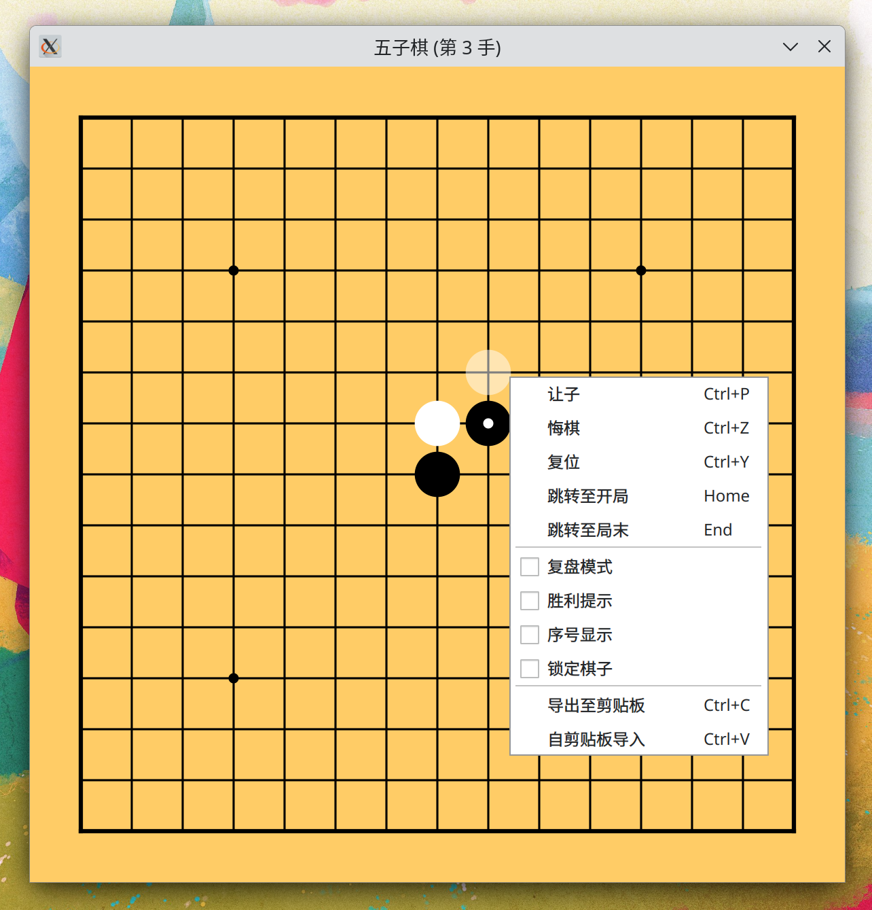

# gomoku-qt

一个基于 Qt 的五子棋软件。

## 功能简介

- 让子：切换棋子。
- 悔棋：撤销上一手棋（如有）。
- 复位：恢复下一手棋（如有）。
- 跳转至开局：重复悔棋至无上一手棋。
- 跳转至局末：重复复位至无下一手棋。
- 复盘模式：开启后无法落子，可通过鼠标滚轮观赏对局。
- 胜利提示：检测到胜利行后以红色虚线标记之。
- 序号显示：在各个棋子上按落子顺序标号。
- 锁定棋子：落子后不切换棋子。
- 导出至剪贴板：导出对局 URI（以 `gomoku://` 起始）至剪贴板。
- 自剪贴板导入：解析剪贴板中的对局 URI 并以结果覆盖当前对局。

[对局 URI 示例](notable-games.md)

界面示例：

